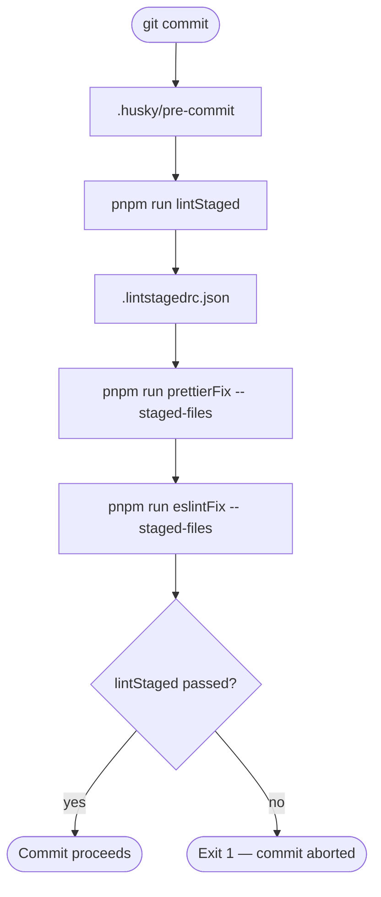
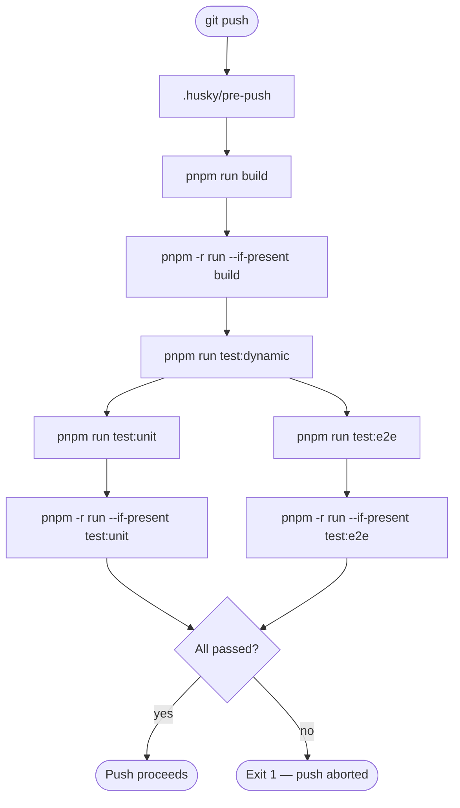
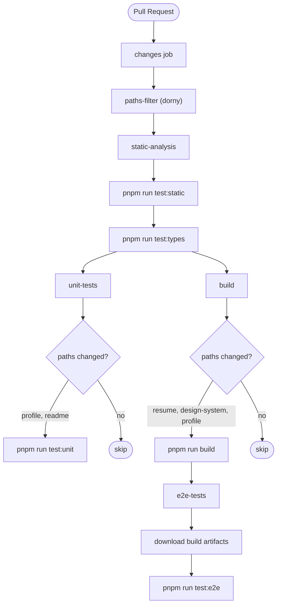
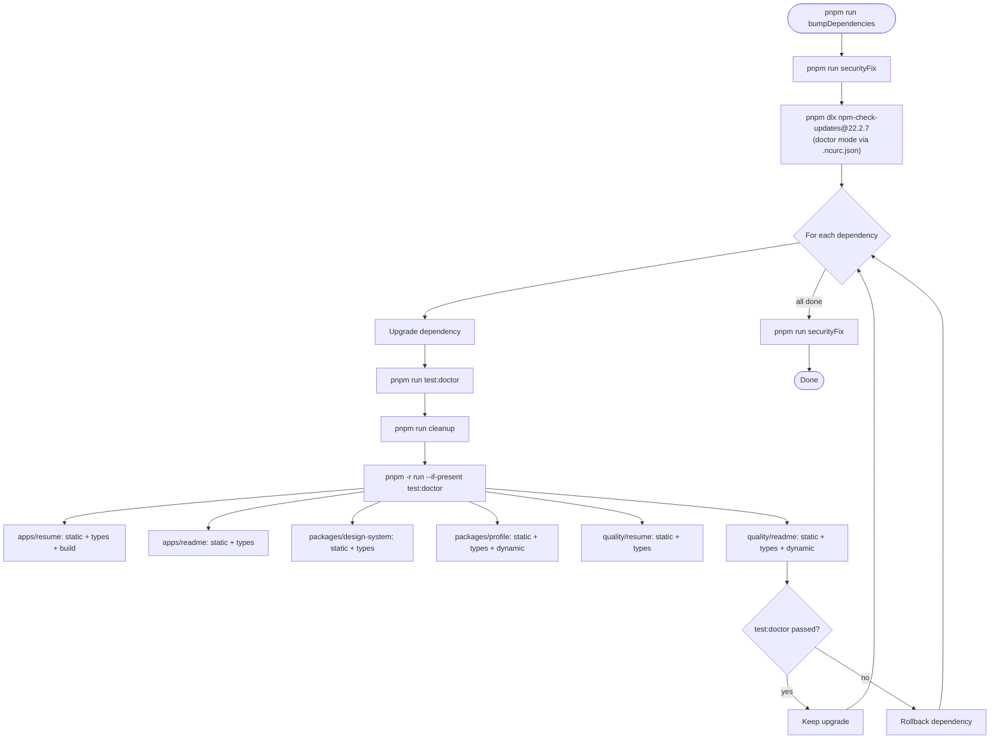

> [← Developer Hub](../CONTRIBUTING.md)

# Quality Gates

Script architecture, pipeline order, and execution context mapping for the echo system in a pnpm monorepo.

This document defines the script architecture, pipeline order, and execution context mapping for the echo system. Every atomic script is reused under the identical name across all contexts — see [Echo Principle](#echo-principle) for the foundational concept. Use the navigation below to jump directly to any section.

## Navigation

- [Echo principle](#echo-principle)
- [Governed files](#governed-files)
  - [Verification commands](#verification-commands)
- [Script taxonomy](#script-taxonomy)
- [Workspace echo matrix](#workspace-echo-matrix)
- [Composite expansion](#composite-expansion)
- [Pipeline order contract](#pipeline-order-contract)
  - [Artifact dependency graph](#artifact-dependency-graph)
- [Execution context comparison](#execution-context-comparison)
- [Tier split: pre-commit vs pre-push](#tier-split-pre-commit-vs-pre-push)
  - [Unified suite philosophy](#unified-suite-philosophy)
- [Pipeline diagrams](#pipeline-diagrams)
- [Per-workspace test:doctor](#per-workspace-testdoctor)
- [Adding a new script](#adding-a-new-script)
- [lint-staged forwarding note](#lint-staged-forwarding-note)
- [Scope difference: lint-staged vs check scripts](#scope-difference-lint-staged-vs-check-scripts)

## Governed Files

This document governs changes to the following file patterns. Any agent modifying these files MUST read this document before creating a handoff. See AGENTS.md § Archivos Gobernados por Documentación for the enforcement mechanism.

| File Pattern                            | Key Sections                                                                     |
| --------------------------------------- | -------------------------------------------------------------------------------- |
| `package.json` (root `scripts` section) | Echo Principle, Composite Expansion, Pipeline Order Contract                     |
| `.husky/*`                              | Tier Split, Unified Suite Philosophy, Execution Context Comparison               |
| `.github/workflows/*`                   | Pipeline Order Contract, Artifact Dependency Graph, Execution Context Comparison |
| `.lintstagedrc.json`                    | Echo Principle (corollary), lint-staged Forwarding Note                          |
| `.ncurc.json`                           | Per-Workspace test:doctor, bumpDependencies                                      |

### Verification Commands

After modifying governed files, run these checks. Any failure blocks merge.

| Check                 | Command                                           | Expected                                                                    |
| --------------------- | ------------------------------------------------- | --------------------------------------------------------------------------- |
| Echo coherence        | `rg 'pnpm run' .husky/ --no-heading`              | Every script name exists in root `package.json` `scripts`                   |
| Artifact completeness | `rg "from '@base/" apps/api/src/ --no-heading -o` | Every `@base/*` runtime import has `dist/` in CI upload-artifact            |
| Hook taxonomy         | `bat .husky/pre-commit .husky/pre-push`           | pre-commit = `lintStaged` only; pre-push = `build` then `test:dynamic` only |

[(back to menu)](#navigation)

---

## Echo Principle

Every atomic script defined in `package.json` is reused with the **identical name** across all execution contexts: local development, lint-staged, pre-commit hook, pre-push hook, CI, and bumpDependencies. There are no per-context aliases, renamed wrappers, or inline tool invocations. When a tool call must happen, a named script is the single source of truth — context consumers call the script, not the tool directly.

**Monorepo extension**: root scripts delegate to workspaces via `pnpm -r run --if-present <script>`. Each workspace exposes the same echo-named scripts for its applicable test nature. The `--if-present` flag makes participation optional — a workspace without `test:unit` simply skips that phase.

This eliminates drift: if a script's command changes in any workspace, every context inherits that change automatically without touching `.lintstagedrc.json`, `.husky/pre-commit`, `.husky/pre-push`, CI workflow files, or `.ncurc.json`.

**Corollary — lint-staged rule**: `.lintstagedrc.json` MUST NOT call bare tool binaries (`prettier`, `eslint`, etc.). It MUST call `pnpm run <script-name> --` so that lint-staged forwards staged filenames as positional args to the named script.

[(back to menu)](#navigation)

---

## Script Taxonomy

### Root Scripts (orchestrator)

| Script             | Type      | Category      | local | lint-staged | pre-commit | pre-push | CI  | bumpDeps |
| ------------------ | --------- | ------------- | :---: | :---------: | :--------: | :------: | :-: | :------: |
| `serve:resume`     | atomic    | serve         |  yes  |     no      |     no     |    no    | no  |    no    |
| `storybook`        | atomic    | serve         |  yes  |     no      |     no     |    no    | no  |    no    |
| `build`            | delegator | build         |  yes  |     no      |     no     |   yes    | yes |    no    |
| `build:storybook`  | atomic    | build         |  yes  |     no      |     no     |    no    | no  |    no    |
| `generate:readme`  | atomic    | build         |  yes  |     no      |     no     |    no    | no  |    no    |
| `test`             | composite | pipeline      |  yes  |     no      |     no     |    no    |  ¹  |    no    |
| `test:doctor`      | composite | pipeline      |  yes  |     no      |     no     |    no    | no  |   yes    |
| `test:static`      | delegator | check         |  yes  |     no      |     no     |    no    | yes |    no    |
| `test:types`       | delegator | check         |  yes  |     no      |     no     |    no    | yes |    no    |
| `test:unit`        | delegator | test          |  yes  |     no      |     no     |    no    | yes |    no    |
| `test:e2e`         | delegator | test          |  yes  |     no      |     no     |    no    | yes |    no    |
| `test:dynamic`     | composite | test          |  yes  |     no      |     no     |   yes    | no  |    no    |
| `eslintFix`        | atomic    | fix           |  yes  |     yes     |     no     |    no    | no  |    no    |
| `prettierFix`      | atomic    | fix           |  yes  |     yes     |     no     |    no    | no  |    no    |
| `lintStaged`       | atomic    | orchestration |  yes  |     no      |    yes     |    no    | no  |    no    |
| `prepare`          | atomic    | lifecycle     |  yes  |     no      |     no     |    no    | no  |    no    |
| `securityCheck`    | atomic    | check         |  yes  |     no      |     no     |    no    | no  |    no    |
| `securityFix`      | atomic    | fix           |  yes  |     no      |     no     |    no    | no  |   yes    |
| `updatePnpm`       | atomic    | maintenance   |  yes  |     no      |     no     |    no    | no  |    no    |
| `cleanup`          | delegator | housekeeping  |  yes  |     no      |     no     |    no    | no  |   yes    |
| `bumpDependencies` | composite | maintenance   |  yes  |     no      |     no     |    no    | no  |    no    |

> ¹ CI does not call the `test` meta-composite — it calls `test:static`, `test:types`, `test:unit`, `test:e2e`, and `build` as individual workflow steps.
>
> **delegator** type: the root script delegates to workspaces via `pnpm -r run --if-present <name>`. Each workspace defines its own implementation.

### Workspace Atomic Scripts

Every workspace exposes a subset of these echo-named scripts:

| Script          | Type      | Tool                                         |
| --------------- | --------- | -------------------------------------------- |
| `eslintCheck`   | atomic    | `eslint .`                                   |
| `eslintFix`     | atomic    | `eslint --fix .`                             |
| `prettierCheck` | atomic    | `prettier --check`                           |
| `prettierFix`   | atomic    | `prettier --write`                           |
| `test:static`   | composite | `eslintCheck` → `prettierCheck`              |
| `test:types`    | atomic    | `tsc --noEmit`                               |
| `test:unit`     | atomic    | `jest` (where applicable)                    |
| `test:e2e`      | atomic    | `playwright test` (where applicable)         |
| `test:dynamic`  | composite | `test:unit` or `test:e2e` (where applicable) |
| `test:doctor`   | composite | per-workspace validation gate                |
| `build`         | atomic    | `ng build` (where applicable)                |
| `cleanup`       | atomic    | workspace-specific artifact removal          |

[(back to menu)](#navigation)

---

## Workspace Echo Matrix

Which echo scripts each workspace exposes. A dash means the workspace does not define that script (skipped by `--if-present`).

| Script         | apps/resume | apps/readme | packages/design-system | packages/profile | quality/resume | quality/readme |
| -------------- | :---------: | :---------: | :--------------------: | :--------------: | :------------: | :------------: |
| `test:static`  |     yes     |     yes     |          yes           |       yes        |      yes       |      yes       |
| `test:types`   |     yes     |     yes     |          yes           |       yes        |      yes       |      yes       |
| `test:unit`    |      —      |      —      |           —            |       yes        |       —        |      yes       |
| `test:e2e`     |      —      |      —      |           —            |        —         |      yes       |       —        |
| `test:dynamic` |      —      |      —      |           —            |       yes        |      yes       |      yes       |
| `test:doctor`  |     yes     |     yes     |          yes           |       yes        |      yes       |      yes       |
| `build`        |     yes     |      —      |           —            |        —         |       —        |       —        |
| `cleanup`      |     yes     |     yes     |          yes           |       yes        |      yes       |      yes       |

[(back to menu)](#navigation)

---

## Composite Expansion

### Root Composites

| Composite          | Expansion                                                                                |
| ------------------ | ---------------------------------------------------------------------------------------- |
| `test:static`      | `pnpm -r run --if-present test:static` (each workspace: `eslintCheck` → `prettierCheck`) |
| `test:types`       | `pnpm -r run --if-present test:types` (each workspace: `tsc --noEmit`)                   |
| `test:dynamic`     | `test:unit` → `test:e2e`                                                                 |
| `test`             | `cleanup` → `build` → `test:static` → `test:types` → `test:dynamic`                      |
| `test:doctor`      | `cleanup` → `pnpm -r run --if-present test:doctor`                                       |
| `build`            | `pnpm -r run --if-present build`                                                         |
| `cleanup`          | `pnpm -r run --if-present cleanup` → `rimraf artifacts/`                                 |
| `bumpDependencies` | `securityFix` → `pnpm dlx npm-check-updates@22.2.7` → `securityFix`                      |

### Per-Workspace test:doctor Expansion

| Workspace              | test:doctor expands to                        | Why                                                      |
| ---------------------- | --------------------------------------------- | -------------------------------------------------------- |
| apps/resume            | `test:static` → `test:types` → `build`        | Angular SSR app — build is the critical gate             |
| apps/readme            | `test:static` → `test:types`                  | ts-node script — no build artifact                       |
| packages/design-system | `test:static` → `test:types`                  | Angular lib — build not needed for doctor validation     |
| packages/profile       | `test:static` → `test:types` → `test:dynamic` | Pure TS + Jest — full validation is fast                 |
| quality/resume         | `test:static` → `test:types`                  | Playwright needs build artifacts — no ordering guarantee |
| quality/readme         | `test:static` → `test:types` → `test:dynamic` | Jest integration tests — self-contained                  |

> quality/resume excludes `test:dynamic` from test:doctor because Playwright e2e tests require `apps/resume` to be built first (`PW_ARTIFACTS_DIR`). Since `pnpm -r run` provides no workspace ordering guarantee, running e2e inside test:doctor would fail non-deterministically.

[(back to menu)](#navigation)

---

## Pipeline Order Contract

Scripts are organized into stages. **No script in stage N may depend on a script from stage N+1 or later.** This is the no-forward-dependency rule.

| Stage | Name         | Scripts                                                     |
| ----- | ------------ | ----------------------------------------------------------- |
| 0     | checkout     | —                                                           |
| 1     | projectSetup | `corepack enable` → `pnpm install`                          |
| 1.5   | cleanup      | `cleanup` (composites run this first)                       |
| 2     | build        | `ng build` (apps/resume)                                    |
| 3     | test:static  | `eslintCheck` → `prettierCheck` (per workspace)             |
| 3.5   | test:types   | `tsc --noEmit` (per workspace)                              |
| 4a    | test:unit    | `jest` (packages/profile, quality/readme)                   |
| 4b    | test:e2e     | `playwright test` (quality/resume — uses stage 2 artifacts) |

> Build runs before all tests. This guarantees build artifacts exist for any test that needs them (Playwright e2e) and follows the standard project convention: compile first, verify second.

### Artifact Dependency Graph

Build outputs and their runtime consumers. All artifact paths are centralized in [`@base/paths`](../packages/paths/README.md). The CI artifact upload uses `packages/*/dist/` glob — new `@base/*` packages are covered automatically without editing `ci.yml`.

| Package            | Build Output Path          | Runtime Consumer                                               | CI Upload Required |
| ------------------ | -------------------------- | -------------------------------------------------------------- | ------------------ |
| `@base/web`        | `artifacts/web/`           | Playwright e2e (validates index.html, main-_.js, styles-_.css) | Yes (explicit)     |
| `@base/api`        | `apps/api/artifacts/dist/` | Playwright webServer (`node artifacts/dist/main`)              | Yes (explicit)     |
| `@base/api` (docs) | `artifacts/api-docs/`      | OpenAPI build script (`open-api.json`)                         | No                 |
| `@base/*` packages | `packages/*/dist/`         | NestJS runtime imports (`from '@base/*'`)                      | Yes (glob)         |

Verification: `rg "from '@base/" apps/api/src/ --no-heading` — every `@base/*` import must resolve to a package under `packages/` whose `dist/` is captured by the glob.

> Post-mortem PR #6 + #8 (2026-07-02/03): explicit package listing in CI artifact upload broke twice — first `api-contract/dist/`, then `paths/dist/`. Replaced with `packages/*/dist/` glob to eliminate manual maintenance.
>
> **NestJS compiled output exception**: `@base/api` build output stays in `apps/api/artifacts/dist/`
> instead of `artifacts/api/` because Node.js module resolution walks `node_modules` from the
> script's physical location. With pnpm strict mode, workspace dependencies live in
> `apps/api/node_modules` — unreachable from `rootPath/artifacts/`. Moving it requires bundling
> (webpack/esbuild) to produce a self-contained artifact like Angular's browser output.
> OpenAPI docs (`artifacts/api-docs/`) are static JSON and follow the centralized pattern.

[(back to menu)](#navigation)

---

## Execution Context Comparison

Cross-check this matrix against `.lintstagedrc.json`, `.husky/pre-commit`, `.husky/pre-push`, `.github/workflows/ci.yml`, and `.ncurc.json` to verify consistency.

| Script         | local | lint-staged |     pre-commit      |   pre-push   |        CI         |        bumpDeps         |
| -------------- | :---: | :---------: | :-----------------: | :----------: | :---------------: | :---------------------: |
| `securityFix`  |  opt  |     no      |         no          |      no      |        no         |     yes (pre+post)      |
| `lintStaged`   |  opt  |     no      |         yes         |      no      |        no         |           no            |
| `prettierFix`  |  opt  |     yes     | no (via lintStaged) |      no      |        no         |           no            |
| `eslintFix`    |  opt  |     yes     | no (via lintStaged) |      no      |        no         |           no            |
| `cleanup`      |  opt  |     no      |         no          |      no      |        no         |  yes (via test:doctor)  |
| `test:static`  |  opt  |     no      |         no          |      no      |   yes (always)    |  yes (via test:doctor)  |
| `test:types`   |  opt  |     no      |         no          |      no      |   yes (always)    |  yes (via test:doctor)  |
| `test:unit`    |  opt  |     no      |         no          |      no      | yes (conditional) |  yes (via test:doctor)  |
| `build`        |  opt  |     no      |         no          | yes (first)  | yes (conditional) | yes (via test:doctor) ³ |
| `test:dynamic` |  opt  |     no      |         no          | yes (second) |        no         |           no            |
| `test:e2e`     |  opt  |     no      |         no          |      no      | yes (conditional) |          no ²           |

> ² test:e2e is excluded from test:doctor to avoid cross-workspace dependency on build artifacts during NCU doctor mode.
>
> ³ Only apps/resume includes `build` in its workspace-level test:doctor.
>
> CI "conditional" means the job runs only when path filters detect changes in relevant workspaces. `test:static` and `test:types` always run regardless of path filters.

[(back to menu)](#navigation)

---

## Tier Split: Pre-commit vs Pre-push

### Unified Suite Philosophy

This project categorizes tests as **static** or **dynamic** — NOT as "unit" or "e2e" for hook purposes. The distinction matters:

- **Static tests** (`test:static` + `test:types`): lint, format, type-check. Zero I/O, zero build artifacts needed. Run in CI always.
- **Dynamic tests** (`test:dynamic` = `test:unit` + `test:e2e`): runtime validation. Needs compiled code, may need build artifacts. Gated behind `build`.

Hooks consume the **unified categories**, never individual test types:

| Hook       | Scripts                  | Speed   | Purpose                 |
| ---------- | ------------------------ | ------- | ----------------------- |
| pre-commit | `lintStaged`             | ~1-2s   | Auto-fix staged files   |
| pre-push   | `build` → `test:dynamic` | ~30-60s | Full dynamic validation |

CI is the exception: it splits `test:unit` and `test:e2e` into separate jobs for parallelism and path-filtered conditional execution. That is an optimization — the conceptual model remains static vs dynamic.

**Why not `test:unit` in pre-commit?** Because the project treats unit and e2e as a single dynamic suite filtered by name. Splitting them across hooks creates a false taxonomy where "unit = fast/safe" and "e2e = slow/thorough." In practice, a broken unit test is no less important than a broken e2e test — both block the push via `test:dynamic`.

**Why `test:dynamic` in pre-push instead of `test:e2e`?** Because `test:dynamic` runs ALL runtime tests (unit + e2e). Using `test:e2e` alone would skip unit test validation at push time, creating a gap where unit regressions only surface in CI.

Both hooks display an informational message and support `--no-verify` bypass.

[(back to menu)](#navigation)

---

## Pipeline Diagrams

### Pre-commit (auto-fix only)



### Pre-push (unified dynamic suite)



### CI (path-filtered parallel)



### bumpDependencies



[(back to menu)](#navigation)

---

## Per-Workspace test:doctor

`test:doctor` is the NCU validation gate — the script that NCU runs after upgrading each dependency. If it fails, NCU rolls back that dependency.

Each workspace defines its own `test:doctor` based on what it can validate in isolation (no cross-workspace dependencies):

- **Full validation** (static + types + dynamic): packages/profile, quality/readme — self-contained workspaces with fast test suites.
- **Structural validation** (static + types + build): apps/resume — the build step is the critical gate for an Angular SSR app.
- **Minimal validation** (static + types): apps/readme, packages/design-system, quality/resume — either no tests, tests need external artifacts, or build is not applicable.

> `securityCheck` (`pnpm audit`) is intentionally excluded from test:doctor. NCU is supposed to FIX CVEs by bumping dependencies — running audit inside the doctor test creates a chicken-and-egg failure where current vulnerabilities block the very upgrades that would resolve them.

[(back to menu)](#navigation)

---

## Adding a New Script

### To an existing workspace

1. Add the atomic script to the workspace's `package.json`
2. If it participates in a composite (`test:static`, `test:dynamic`, `test:doctor`), add it to the relevant `&&` chain
3. If the root should delegate it, ensure the root has a matching `pnpm -r run --if-present <name>` script

### To a new workspace

1. Add the workspace directory to `pnpm-workspace.yaml` packages glob
2. Create `package.json` with the standard echo scripts: `test:static`, `test:types`, `cleanup`, `test:doctor`
3. Add test scripts (`test:unit`, `test:e2e`, `test:dynamic`) as applicable
4. The root delegators pick up the new workspace automatically via `--if-present`

### Propagation rules

| Add to             | Propagates to                                                           |
| ------------------ | ----------------------------------------------------------------------- |
| `test:static` (ws) | root `test:static`, `test`, CI static-analysis, workspace `test:doctor` |
| `test:types` (ws)  | root `test:types`, `test`, CI static-analysis, workspace `test:doctor`  |
| `test:unit` (ws)   | root `test:unit`, `test:dynamic`, `test`, pre-push (via dynamic), CI    |
| `test:e2e` (ws)    | root `test:e2e`, `test:dynamic`, `test`, pre-push (via dynamic), CI     |
| `build` (ws)       | root `build`, `test`, pre-push, CI build                                |
| `test:doctor` (ws) | root `test:doctor`, `bumpDependencies` (via NCU)                        |

[(back to menu)](#navigation)

---

## lint-staged Forwarding Note

`prettierFix` and `eslintFix` are defined **without a glob** (`prettier --write`, `eslint --fix`) because lint-staged passes the list of staged filenames as trailing arguments. Using `pnpm run prettierFix --` causes pnpm to forward everything after `--` directly to the underlying tool, so each staged file is processed individually.

If a glob were embedded in the script (e.g., `prettier --write '{src}/**/*.ts'`), pnpm would append the staged filenames AFTER the glob, causing the glob matches to be formatted as well. Option A (no glob in the script) is intentional and verified.

When invoking these scripts standalone during local development, pass the glob explicitly:

```bash
pnpm run prettierFix -- '{apps,packages,quality}/**/src/**/*.ts'
pnpm run eslintFix -- '{apps,packages,quality}/**/src/**/*.ts'
```

[(back to menu)](#navigation)

---

## Scope Difference: lint-staged vs Check Scripts

`.lintstagedrc.json` targets `*.{js,json,md,mjs,ts,tsx}` — six file extensions. The check scripts (`eslintCheck`, `prettierCheck`) in each workspace target `*.ts` files within `src/`, while root-level eslint also covers `*.{json,md}`.

This means lint-staged applies fixes to a broader set of extensions during pre-commit. CI verifies workspace source files via the workspace-level check scripts. The echo principle is maintained: everything lint-staged fixes has a corresponding check script that CI verifies.

[(back to menu)](#navigation)
